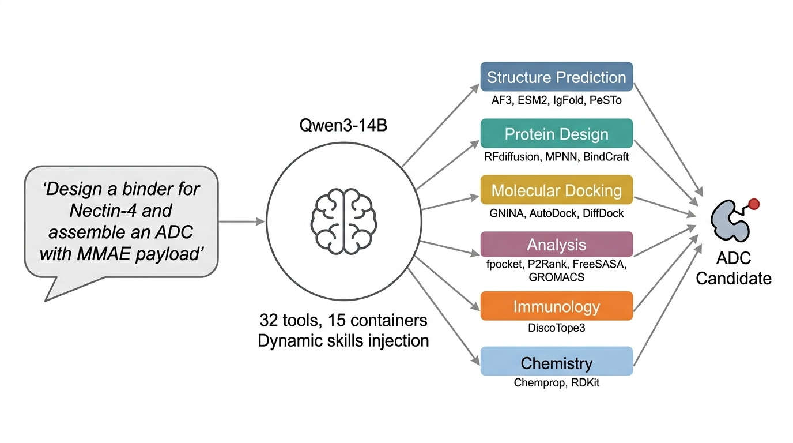
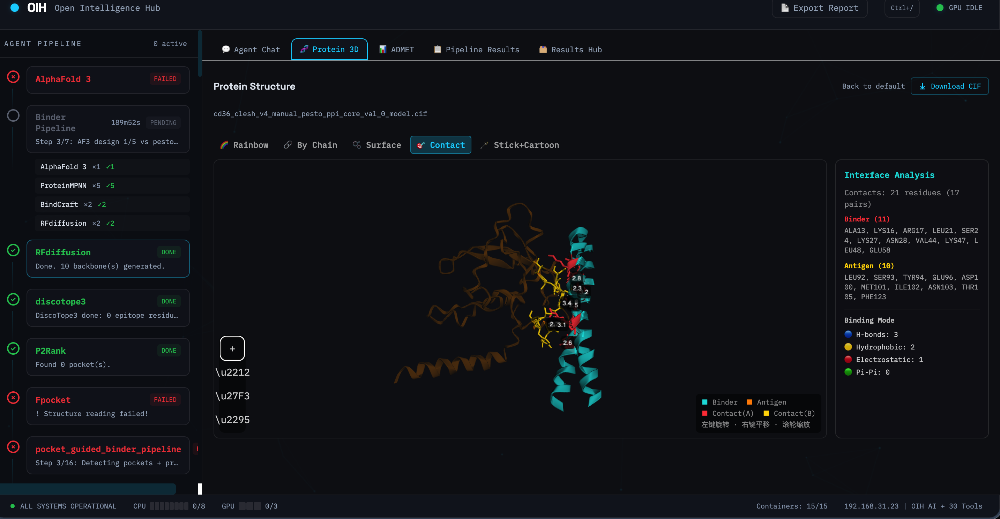
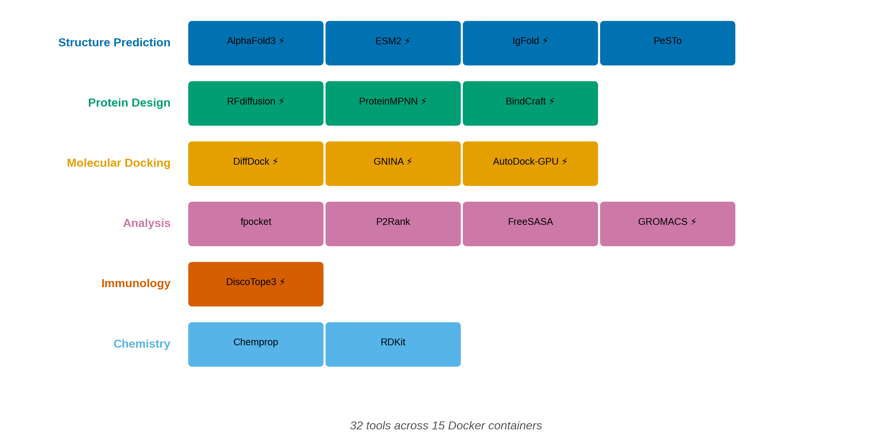
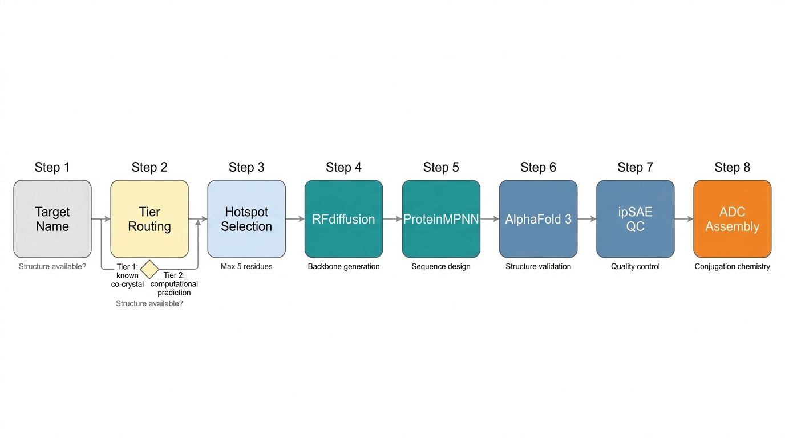

# OIH — Open Intelligence Hub

An autonomous LLM-agent platform for computational binder design and conjugation-aware prioritization of antibody–drug conjugates.



## Overview

OIH orchestrates **32 computational biology tools** across **15 Docker containers** through a large language model agent. Given a target protein, the platform autonomously executes a complete binder design pipeline — from binding-site identification through RFdiffusion backbone generation, ProteinMPNN sequence design, AlphaFold 3 validation, to final ADC conjugation with linker and payload selection.

The agent is **LLM-agnostic**: it works with local open-weight models (Qwen3-14B via vLLM) or cloud APIs (Anthropic Claude, OpenAI GPT-4, DeepSeek) without changing any tool or pipeline logic.



## Tool Inventory

| Category | Tools |
|----------|-------|
| **Structure Prediction** | AlphaFold 3 |
| **Protein Design** | RFdiffusion, ProteinMPNN, BindCraft |
| **Binding Site Analysis** | fpocket, P2Rank, PeSTo, DiscoTope3, IgFold, ipSAE |
| **Molecular Docking** | GNINA, AutoDock-GPU, DiffDock |
| **MD Simulation** | GROMACS |
| **ML Analysis** | ESM2 (embedding + mutant scan), Chemprop (ADMET) |
| **ADC Design** | FreeSASA (conjugation sites), Linker Selection, RDKit Conjugation |
| **Literature** | PubMed + bioRxiv + IEDB + SAbDab RAG |

## Architecture



- **LLM Agent** — Multi-round function calling with dynamic skills injection (26 workflow documents)
- **Tier Routing** — Structure-guided (Tier 1: known complex) and prediction-guided (Tier 2: PeSTo + RAG) hotspot selection
- **6-Dimension Pocket Scoring** — P2Rank + SASA + conservation + RAG literature + electrostatics + PPI epitope
- **Validation** — AlphaFold 3 + ipSAE interface quality filtering
- **ADC Assembly** — Automated conjugation site selection (FreeSASA) and linker chemistry (RDKit, 7 conjugation chemistries)



## Hardware Requirements

| Resource | Minimum | Recommended |
|----------|---------|-------------|
| GPU 0 (LLM) | 24 GB VRAM | RTX 4090 / A100 |
| GPU 1 (compute) | 24 GB VRAM | 48 GB (A6000 / dual-4090) |
| CPU | 8 cores | 16+ cores |
| RAM | 32 GB | 64 GB+ |
| Storage | 200 GB | 500 GB (includes AF3 databases) |

A single GPU setup is possible by time-sharing between LLM and compute, though this reduces throughput.

## Installation

### Prerequisites

- Docker with NVIDIA Container Toolkit (`nvidia-docker`)
- Two NVIDIA GPUs (see Hardware above)
- Python 3.11+

### 1. Clone and install dependencies

```bash
git clone https://github.com/liugangg/oih-platform.git
cd oih-platform
pip install -r requirements.txt
```

### 2. Build / pull container images

Each tool runs in its own Docker container. Dockerfiles and build instructions are provided in the [`docker/`](docker/) directory. The images used in the paper are also available on Docker Hub:

```bash
docker compose pull        # pull pre-built images
# or
docker compose build       # build from Dockerfiles
```

### 3. Download model weights and databases

| Component | Size | Source |
|-----------|------|--------|
| AlphaFold 3 models | ~1 GB | [DeepMind](https://github.com/google-deepmind/alphafold3) |
| AlphaFold 3 databases | ~450 GB | [DeepMind](https://github.com/google-deepmind/alphafold3) |
| RFdiffusion weights | ~1 GB | [Baker Lab](https://github.com/RosettaCommons/RFdiffusion) |
| ESM-2 650M | ~2.5 GB | [Meta](https://github.com/facebookresearch/esm) |
| Chemprop ADMET models | ~50 MB | Trained on MoleculeNet (included in `models/admet/`) |

### 4. Start the platform

```bash
# Start LLM inference (GPU 0)
docker compose -f docker-compose.vllm.yml up -d

# Start bio-computing containers (GPU 1)
docker compose up -d

# Start the API server
python -m uvicorn main:app --host 0.0.0.0 --port 8080
```

### 5. Open the dashboard

Navigate to `http://<server-ip>:8080/` and type natural language commands:
- *"Design a binder targeting HER2"*
- *"Predict the structure of TP53 with AlphaFold3"*
- *"Run ADMET profiling for MMAE"*

## LLM Backend

The platform is LLM-agnostic. Switch backends via environment variables:

```bash
# Local Qwen (default — data stays on your server)
LLM_PROVIDER=local python -m uvicorn main:app --port 8080

# Anthropic Claude
LLM_PROVIDER=anthropic LLM_API_KEY=sk-ant-xxx python -m uvicorn main:app --port 8080

# OpenAI GPT-4o
LLM_PROVIDER=openai LLM_API_KEY=sk-xxx python -m uvicorn main:app --port 8080
```

Or use a `.env` file:

```env
LLM_PROVIDER=anthropic
LLM_API_KEY=sk-ant-xxx
LLM_MODEL=claude-sonnet-4-20250514
```

## API

All tools are accessible both through the LLM agent (natural language) and directly via REST:

| Endpoint | Function |
|----------|----------|
| `POST /api/v1/agent/chat` | LLM agent — natural language interface (SSE streaming) |
| `POST /api/v1/pipeline/binder_design` | End-to-end binder design + ADC pipeline |
| `POST /api/v1/structure/alphafold3` | AlphaFold 3 structure prediction |
| `POST /api/v1/design/rfdiffusion` | RFdiffusion backbone generation |
| `POST /api/v1/docking/gnina` | GNINA molecular docking |
| `POST /api/v1/md/gromacs` | GROMACS MD simulation |
| `GET  /api/v1/tasks/{id}` | Task status and results |
| `GET  /health` | System and container health check |

Full API documentation is available at `/docs` (Swagger UI) once the server is running.

## Reproducibility

OIH uses a two-tier target classification system as described in the accompanying manuscript (Liu et al., Nature Machine Intelligence, 2026):

- **Tier 1** targets have known antibody co-crystal structures (e.g., HER2/trastuzumab 1N8Z, EGFR/cetuximab 1YY9). The pipeline extracts interface residues directly from the complex as design hotspots. This evaluates the platform's *execution capability*.
- **Tier 2** targets lack co-crystal structures (e.g., Nectin-4, CD36, TROP2). The pipeline uses PeSTo PPI interface prediction to identify hotspots *de novo*. This evaluates the platform's *discovery capability*.

Expert prior knowledge (PDB IDs, domain boundaries, known ligand chains) is stored in `config/target_registry.json` as an explicit configuration module. The LLM agent consults this registry during tier classification but does not receive the final binder design answer — it must still orchestrate the full RFdiffusion → ProteinMPNN → AlphaFold 3 → ipSAE pipeline autonomously.

To reproduce results on a new target not in the registry, provide only a PDB ID or UniProt accession. The agent will classify it as Tier 2 and use PeSTo for hotspot discovery.

All 36 post-fix designs reported in the paper, along with full tool schemas and prompt templates, are available in this repository.

## Key Results

Autonomous binder design and in silico ADC assembly across five oncology targets:

| Target | Best ipTM | Best ipSAE | ADC Conjugation |
|--------|-----------|------------|-----------------|
| Nectin-4 | 0.87 | 0.68 | Modelled |
| HER2 | 0.85 | 0.53 | Modelled |
| EGFR | 0.52 | 0.19 | Modelled |
| CD36 | 0.58 | 0.056 | — |
| TROP2 | 0.22 | 0.000 | — |

See the paper for complete results including 36-design CLESH ablation, ESM2 filtering, and IgFold validation.

## Project Structure

```
oih-platform/
├── main.py                  # FastAPI entry point
├── qwen_agent.py            # LLM agent: multi-round tool-calling loop
├── skills_loader.py         # Dynamic skill document injection
├── core/
│   ├── config.py            # Environment-based configuration
│   ├── llm_backend.py       # LLM-agnostic backend (local/cloud)
│   ├── task_manager.py      # Three-queue async task scheduler
│   └── docker_client.py     # Container health monitoring
├── routers/                 # Tool execution logic (one file per category)
│   ├── pipeline.py          # End-to-end pipelines (binder, drug discovery)
│   ├── structure_prediction.py
│   ├── protein_design.py
│   ├── pocket_analysis.py
│   ├── molecular_docking.py
│   ├── md_simulation.py
│   ├── ml_tools.py
│   ├── adc.py
│   └── ...
├── tool_definitions/
│   └── qwen_tools.py        # Tool schemas (OpenAI function-calling format)
├── skills/                  # Workflow documents injected into LLM context
├── docker-compose.yml       # Bio-computing containers (GPU 1)
├── Dockerfile               # API server container
└── tests/                   # Unit and integration tests
```

## Third-Party Licenses

OIH itself is released under the MIT License. Several upstream tools have their own licenses:

| Tool | License | Notes |
|------|---------|-------|
| AlphaFold 3 | [DeepMind License](https://github.com/google-deepmind/alphafold3/blob/main/LICENSE) | Non-commercial research use |
| PeSTo | CC-BY-NC-SA 4.0 | Non-commercial |
| RFdiffusion | BSD 2-Clause | |
| ProteinMPNN | MIT | |
| BindCraft | MIT | |
| GNINA | Apache 2.0 | |
| GROMACS | LGPL 2.1 | |
| MaSIF | Apache 2.0 | |

Users should review upstream licenses before commercial deployment.

## Citation

If you use OIH in your research, please cite:

```bibtex
@article{liu2026oih,
  title={An autonomous LLM-agent platform for computational binder design
         and conjugation-aware prioritization of antibody--drug conjugates},
  author={Liu, Ganggang and He, Mingjie and Sun, Liang and Chen, Fuxian and Zhang, Yu},
  journal={Nature Machine Intelligence},
  year={2026},
  note={Submitted}
}
```
## License

[MIT License](LICENSE)
